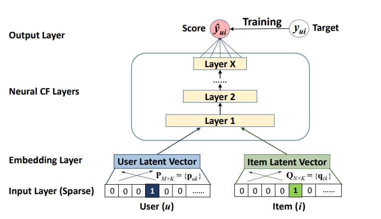
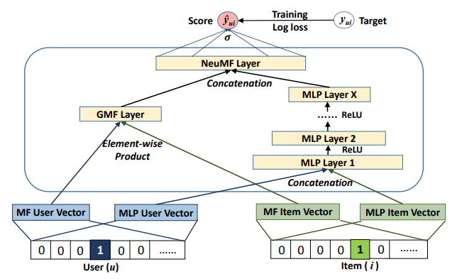

# Neural Collaborative Filtering
> Reproduction of the work of Dr Xiangnan He et all with Python and Keras

## Introduction
In this university project we reproduced the work from the paper:

*Xiangnan He, Lizi Liao, Hanwang Zhang, Liqiang Nie, Xia Hu and Tat-Seng Chua (2017). [Neural Collaborative Filtering](https://dl.acm.org/doi/10.1145/3038912.3052569). In Proceedings of WWW '17, Perth, Australia, April 03-07, 2017*.

The idea of the original work is to apply techniques based on **neural networks** in the context of the **recommendation problem**, in particular **collaborative filtering**, on the basis of **implicit feedback**. The result of the research conducted by the authors led to the birth of a **general framework** named **NCF** which can be used to express, generalize and extend **Matrix Factorization** thanks to its neural architecture. This framework can also model the interaction between user and item, the key factor in collaborative filtering, using a **Multi-Layer Perceptron** that allows the framework to learn high level non-linear features from the data. We carried out **experiments** on two real-world dataset, [MovieLens](https://grouplens.org/datasets/movielens/) and Pinterest, following the guidelines given by the original paper.

<h5>Figure 1. Neural Collaborative Filtering (NCF) framework representation </h5>

The authors proposed to fuse the **linear capabilities** of Matrix Factorization and the **non-linear** ones given by the Multi-Layer Perceptron in a new model called **Neural Matrix Factorization** (NeuMF). This new instance of the NCF framework is able to better learn from the data and modelling the interaction function, offering better recommendation performance.

<h5>Figure 2. Neural Matrix Factorization (NeuMF) model </h5>

<h4>

For more details on how we implemented the code and how carried out the experiments see the [Final Report](https://github.com/GiovanniBurbi/Neural-Collaborative-Filtering/blob/main/FinalReport.pdf)

</h4>

## Getting Started
We have used Google Colaboratory to implement this project, the source code can be found in [**NeuralCollaborativeFiltering.ipynb**](https://colab.research.google.com/drive/1kj1qB2FAZMosN9hEEZScykK0lvyBc2Sk?usp=sharing). 
